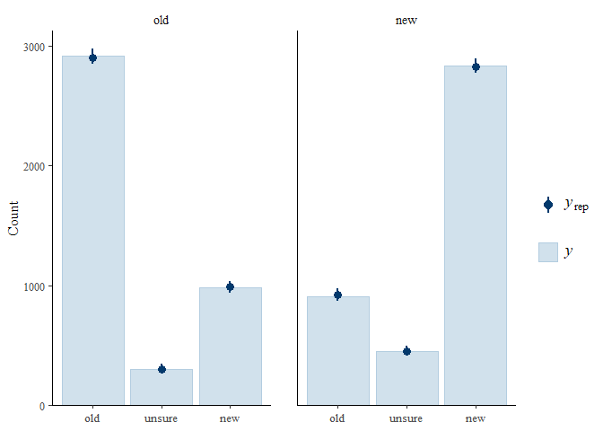

<!-- README.md is generated from README.Rmd. Please edit that file -->

# mptstan

<!-- badges: start -->
<!-- badges: end -->

Estimate multinomial processing tree (MPT) models, a model class popular
in cognitive psychology, in a Bayesian framework using package `brms`
(i.e., ultimately `Stan`). This allows specifying models with any type
of multivariate normal hierarchical or multilevel structure, including
models with single and multiple random effects (i.e., crossed random
effects). Model specification can be tailored for each model parameter.

## Installation

You can install the development version of `mptstan` from
[GitHub](https://github.com/) with:

``` r
# install.packages("devtools")
devtools::install_github("mpt-network/mptstan")
```

Because `mptstan` is based on `brms` and therefore `Stan`, you will need
a C++ compiler to use the package. Installation instructions for a C++
compiler for your operationg system can be found here:
<https://github.com/stan-dev/rstan/wiki/RStan-Getting-Started>

## Example

We begin the analysis by loading `mptstan`. We then use `options()` to
auto-detect the numbers of cores and ensure fitting uses multiple cores.

``` r
library(mptstan)
options(mc.cores = parallel::detectCores())
```

We show the analysis of a recognition memory data set (from Singmann,
Kellen, & Klauer, 2013) using the unsure-extended 2-high threshold model
to a dataset investigating the other-race effect (i.e., a study with two
different types of old and new items, own-race faces and other-race
faces). This data is available in `mptstan` as `skk13`. We will analyse
this data using crossed-random effects for participants and items.

``` r
str(skk13)
#> 'data.frame':    8400 obs. of  7 variables:
#>  $ id   : Factor w/ 42 levels "1","3","5","6",..: 1 1 1 1 1 1 1 1 1 1 ...
#>  $ trial: Factor w/ 200 levels "1","2","3","4",..: 1 2 3 4 5 6 7 8 9 10 ...
#>  $ race : Factor w/ 2 levels "german","arabic": 2 1 1 1 1 1 1 2 1 1 ...
#>  $ type : Factor w/ 2 levels "old","new": 1 1 2 2 1 1 1 1 2 2 ...
#>  $ resp : Factor w/ 3 levels "old","unsure",..: 3 1 3 1 1 1 3 1 3 3 ...
#>  $ rt   : num  4.68 2.75 4.25 1.6 0.95 ...
#>  $ stim : Factor w/ 200 levels "A001","A002",..: 40 132 117 143 140 162 193 19 120 170 ...
```

Becuase we want the MPT model parameters to differ across the `race`
factor in the data (i.e., the race of the to-be-recognised face), we set
contrasts appropriate for Bayesian models for the current `R` session
using `options(contrasts = ...)`. In particular, we use the contrasts
proposed by Rouder et al. (2012) that guarantee two things: (a)
contrasts sum to zero: for each factor/coefficient, 0 corresponds to the
mean value and not to a specific factor level. Consequently, these
contrasts are appropriate for models that include interactions. (b)
contrasts have the same marginal priors for each factor level. These
priors are available in package `bayestestR` as `contr.equalprior`.
(Note that setting contrasts using `options()` affect most regression
functions in `R`, such as `lm` and `lmer`.)

``` r
library("bayestestR")
options(contrasts=c('contr.sum', 'contr.equalprior'))
```

### Step 1: Create MPT Model Object

The first step when using `mptstan` is the creation of a MPT model
object using `make_mpt()` (which creates an object of class
`mpt_model`).

`make_mpt()` can read MPT models in both the commonly used `EQN` model
format (e.g., used by `TreeBUGS`) and the `easy` format introduced by
`MPTinR`.

``` r
# For the easy EQN format, we just need the EQN file location:
EQNFILE <- system.file("extdata", "u2htm.eqn", package = "mptstan")
u2htsm_model <- make_mpt(EQNFILE) ## make_mpt() auto-detects EQN files from name
#> model type auto-detected as 'eqn'
#> Warning: parameter names ending with a number amended with 'x'
u2htsm_model
#> 
#> MPT model with 4 independent categories (from 2 trees) and 4 parameters:
#>   Dn, Do, g1x, g2x
#> 
#> Tree 1: old
#>   Categories: old, unsure, new 
#>   Parameters: Do, g1x, g2x
#> Tree 2: new
#>   Categories: old, unsure, new 
#>   Parameters: Dn, g1x, g2x

## Alternatively, we can just enter the equations and use the easy format.
u2htm <- "
# Old Items
Do + (1 - Do) * (1 - g1) * g2
(1 - Do) * g1
(1 - Do) * (1 - g1) * (1 - g2)

# New Items
(1 - Dn) * (1 - g1) * g2
(1 - Dn) * g1
Dn + (1 - Dn) * (1 - g1) * (1 - g2)
"
# for the easy format, we need to specify tree names and category names
u2htsm_model_2 <- make_mpt(text = u2htm, 
                           trees = c("old", "new"),
                           categories = rep(c("old", "unsure", "new"), 2))
#> Warning: parameter names ending with a number amended with 'x'
u2htsm_model_2
#> 
#> MPT model with 4 independent categories (from 2 trees) and 4 parameters:
#>   Dn, Do, g1x, g2x
#> 
#> Tree 1: old
#>   Categories: old, unsure, new 
#>   Parameters: Do, g1x, g2x
#> Tree 2: new
#>   Categories: old, unsure, new 
#>   Parameters: Dn, g1x, g2x
```

As shown in the output, if a model parameter ends with a number,
`mptstan` adds an `x` to the parameter name (as `brms` cannot handle
custom parameters ending with a number). If a model already has a
parameter with this name (i.e., the original parameter name ending with
a number plus x) this might leave to problems and should be avoided.

### Step 2: Create Formula (Optional)

The second and optional step is creating an MPT formula object with
`mpt_formula()`. Here, we show the case in which the same formula
applies to all MPT model parameters. In this case, we specify only a
single formula and also need to pass the MPT model object (as the
`model` argument).

In the formula, the left-hand-side specifies the response variable (in
the present case `resp`) and the right-hand side specifies the
fixed-effect regression coefficients and random-effect (i.e.,
multilevel) strutucre using the `brms`-extended `lme4` syntax. Here, we
have one fixed-effect, for the `race` factor. Furthermore, we have both
by-participant and by-item random-effect terms. For the by-participant
random-effect term we estimate both random intercepts and random slopes
for `race` (as `race` is a within-participants factor). For the by-item
random-effect term we only estimate random intercepts. For both
random-effect terms we add a unique identifier between the regression
structure for the random-effect term (i.e., `race` or `1`) and the
grouping factor (i.e., `id` and `stim`), `p` for participants and `i`
for items. These identifiers ensures that random-effect correlations are
estimated across MPT model parameters. In other words, these identifiers
ensure that for each random-effect term the full correlation matrix
across all MPT model parameters is estimated in line with Klauer’s
(2010) latent trait approach.

``` r
u2htm_formula <- mpt_formula(resp ~ race + (race|p|id) + (1|i|stim), 
                             model = u2htsm_model)
u2htm_formula
#> MPT formulas (response: resp):
#> Dn ~ race + (race | p | id) + (1 | i | stim)
#> <environment: 0x00000213b8017d38>
#> Do ~ race + (race | p | id) + (1 | i | stim)
#> <environment: 0x00000213b8017d38>
#> g1x ~ race + (race | p | id) + (1 | i | stim)
#> <environment: 0x00000213b8017d38>
#> g2x ~ race + (race | p | id) + (1 | i | stim)
#> <environment: 0x00000213b8017d38>
```

As shown in the output, if we specify a MPT model formula with only a
single formula, this formula applies to all MPT model parameters. In
this case, using `mpt_formula()` is optional and we could also specify
the formula as the first argument of the fitting function, `mpt()`.

Creating a formula object is not optional if you want to specify an
individual and potentially different formula for each MPT model
parameter. In this case, the left-hand-side of each formula needs to
specify the MPT model parameter and the response variable needs to be
specified via the `response` argument. For examples, see `?mpt_formula`.

### Step 3: Fit Model

With the MPT model object and model formula we are ready to fit the MPT
model. For this, we use function `mpt()` which in addition to the two
aforementioned objects requires the data as well as the variable in the
data distinguishing to which tree (or data type) a particular response
belongs. In the present case that is the `type` variable. (The tree
variable can only be omitted in case the model consists of solely one
tree.)

In addition to the required arguments (model object, formula, data, and
tree variable), we can pass further arguments to `brms::brm()` and
onward to `rstan::stan()`, which ultimately performs the MCMC sampling.
Here, we also pass `init_r = 0.5` which ensures that the random start
values are drawn from a uniform distribution ranging from -0.5 to 0.5
(instead of the default -2 to 2). Our testing has shown that with
`init_r = 0.5` MPT models with random-effect terms are much less likely
to fail initialisation. We could pass further arguments such as
`chains`, `warmup`, `iter`, or `thin` to control the MCMC sampling.

Note that fitting this model can take up to an an hour or longer
(depending on your computer).

``` r
fit_skk <- mpt(u2htm_formula, data = skk13,
               tree = "type",
               init_r = 0.5
)
#> Warning: Bulk Effective Samples Size (ESS) is too low, indicating posterior means and medians may be unreliable.
#> Running the chains for more iterations may help. See
#> https://mc-stan.org/misc/warnings.html#bulk-ess
#> Warning: Tail Effective Samples Size (ESS) is too low, indicating posterior variances and tail quantiles may be unreliable.
#> Running the chains for more iterations may help. See
#> https://mc-stan.org/misc/warnings.html#tail-ess
```

### Step 4: Post-Processing

`mptstan` uses `brms::brm()` for model estimation and returns a
`brmsfit` object. As a consequence, the full post-processing
functionality of `brms` and associated packages is available (e.g.,
`emmeans`, `tidybayes`). However, for the time being `mptstan` also does
not contain any MPT-specific post-processing functionality. Thus, the
`brms` post-processing functionality is the only thing that is
available. Whereas this functionality is rather sophisticated and
flexible, it is not always perfect for MPT models with many parameters.

When inspecting post-processing output from `brms`, the most important
thing to understand is that `brms` does not label the first parameter in
a model (i.e., as shown in the model object). For example, the model
parameter `Intercept` refers to the intercept of the first MPT model
parameter (i.e., `Dn` in the present case). All other parameters are
labelled with the corresponding MPT model parameter name, but not the
first MPT model parameter.

The default `summary()` method for `brms` objects first lists the
estimates for the random-effects terms and then the estimates of the
fixed-effects regression coefficients. As mentioned in the previous
paragraphs, all estimates have a label clarifying which MPT model
parameter they refer to with the exception of estimates referring to the
first MPT model parameter, here `Dn`.

``` r
summary(fit_skk)
#>  Family: mpt 
#>   Links: mu = probit; Do = probit; g1x = probit; g2x = probit 
#> Formula: resp ~ race + (race | p | id) + (1 | i | stim) 
#>          Do ~ race + (race | p | id) + (1 | i | stim)
#>          g1x ~ race + (race | p | id) + (1 | i | stim)
#>          g2x ~ race + (race | p | id) + (1 | i | stim)
#>    Data: structure(list(id = structure(c(1L, 1L, 1L, 1L, 1L (Number of observations: 8400) 
#>   Draws: 4 chains, each with iter = 2000; warmup = 1000; thin = 1;
#>          total post-warmup draws = 4000
#> 
#> Multilevel Hyperparameters:
#> ~id (Number of levels: 42) 
#>                                  Estimate Est.Error l-95% CI u-95% CI Rhat Bulk_ESS Tail_ESS
#> sd(Intercept)                        0.77      0.17     0.48     1.15 1.00     1023     1907
#> sd(race1)                            0.11      0.08     0.00     0.32 1.01      923     1329
#> sd(Do_Intercept)                     0.56      0.09     0.42     0.75 1.00     1183     1994
#> sd(Do_race1)                         0.09      0.05     0.01     0.21 1.02      357      613
#> sd(g1x_Intercept)                    1.07      0.15     0.81     1.41 1.00     1325     2191
#> sd(g1x_race1)                        0.15      0.04     0.07     0.24 1.00     1501     1548
#> sd(g2x_Intercept)                    0.54      0.09     0.38     0.74 1.00      974     1883
#> sd(g2x_race1)                        0.24      0.06     0.13     0.37 1.00      591     1192
#> cor(Intercept,race1)                -0.06      0.34    -0.68     0.61 1.00     2515     2236
#> cor(Intercept,Do_Intercept)          0.45      0.17     0.08     0.74 1.01      697      838
#> cor(race1,Do_Intercept)             -0.09      0.34    -0.70     0.56 1.04      175      642
#> cor(Intercept,Do_race1)              0.06      0.29    -0.51     0.59 1.00     1998     2964
#> cor(race1,Do_race1)                 -0.06      0.34    -0.66     0.60 1.01      888     2492
#> cor(Do_Intercept,Do_race1)           0.19      0.30    -0.43     0.71 1.00     2638     2390
#> cor(Intercept,g1x_Intercept)        -0.03      0.21    -0.41     0.38 1.00      352      998
#> cor(race1,g1x_Intercept)            -0.04      0.32    -0.65     0.55 1.02      194      571
#> cor(Do_Intercept,g1x_Intercept)      0.02      0.16    -0.29     0.34 1.00     1192     1740
#> cor(Do_race1,g1x_Intercept)         -0.22      0.28    -0.70     0.37 1.02      230      368
#> cor(Intercept,g1x_race1)            -0.16      0.23    -0.58     0.32 1.00     1644     2755
#> cor(race1,g1x_race1)                -0.08      0.32    -0.67     0.54 1.02      322     1223
#> cor(Do_Intercept,g1x_race1)          0.26      0.22    -0.18     0.66 1.00     2997     3290
#> cor(Do_race1,g1x_race1)             -0.03      0.31    -0.62     0.57 1.00     1241     2420
#> cor(g1x_Intercept,g1x_race1)         0.27      0.25    -0.24     0.69 1.00     3110     3015
#> cor(Intercept,g2x_Intercept)        -0.43      0.19    -0.76    -0.03 1.01      494      977
#> cor(race1,g2x_Intercept)             0.01      0.31    -0.60     0.60 1.01      333      896
#> cor(Do_Intercept,g2x_Intercept)      0.02      0.18    -0.32     0.38 1.00     1521     2482
#> cor(Do_race1,g2x_Intercept)          0.01      0.28    -0.55     0.55 1.00      727     1376
#> cor(g1x_Intercept,g2x_Intercept)     0.18      0.18    -0.18     0.52 1.00      914     2182
#> cor(g1x_race1,g2x_Intercept)         0.24      0.24    -0.24     0.68 1.00     1049     1985
#> cor(Intercept,g2x_race1)             0.31      0.22    -0.16     0.69 1.01      738     1589
#> cor(race1,g2x_race1)                 0.11      0.33    -0.53     0.70 1.01      450     1083
#> cor(Do_Intercept,g2x_race1)          0.17      0.19    -0.23     0.53 1.00     1683     2378
#> cor(Do_race1,g2x_race1)              0.15      0.30    -0.50     0.67 1.00      581     1029
#> cor(g1x_Intercept,g2x_race1)         0.13      0.21    -0.29     0.52 1.00     1023     2122
#> cor(g1x_race1,g2x_race1)            -0.15      0.27    -0.63     0.38 1.00     1480     2458
#> cor(g2x_Intercept,g2x_race1)        -0.13      0.22    -0.55     0.31 1.01      912     2153
#> 
#> ~stim (Number of levels: 200) 
#>                                  Estimate Est.Error l-95% CI u-95% CI Rhat Bulk_ESS Tail_ESS
#> sd(Intercept)                        0.87      0.14     0.63     1.17 1.00      789     1991
#> sd(Do_Intercept)                     0.43      0.06     0.33     0.55 1.01      860     1793
#> sd(g1x_Intercept)                    0.06      0.04     0.00     0.15 1.01      750     1745
#> sd(g2x_Intercept)                    0.42      0.06     0.30     0.55 1.02      391     1025
#> cor(Intercept,Do_Intercept)          0.31      0.16    -0.01     0.62 1.01      299     1006
#> cor(Intercept,g1x_Intercept)        -0.16      0.40    -0.83     0.69 1.00     2757     2354
#> cor(Do_Intercept,g1x_Intercept)     -0.25      0.39    -0.86     0.61 1.00     2165     2387
#> cor(Intercept,g2x_Intercept)        -0.45      0.22    -0.84    -0.01 1.02      219      578
#> cor(Do_Intercept,g2x_Intercept)     -0.05      0.19    -0.39     0.35 1.01      378      793
#> cor(g1x_Intercept,g2x_Intercept)    -0.09      0.38    -0.80     0.66 1.02      116      274
#> 
#> Regression Coefficients:
#>               Estimate Est.Error l-95% CI u-95% CI Rhat Bulk_ESS Tail_ESS
#> Intercept        -0.55      0.21    -0.98    -0.18 1.00      560     1447
#> Do_Intercept      0.13      0.11    -0.08     0.34 1.00     1078     1644
#> g1x_Intercept    -1.35      0.17    -1.70    -1.02 1.00     1289     2219
#> g2x_Intercept    -0.38      0.12    -0.61    -0.15 1.00      875     2056
#> race1             0.37      0.11     0.15     0.60 1.00     1166     2217
#> Do_race1          0.01      0.05    -0.10     0.11 1.00     1372     1850
#> g1x_race1        -0.06      0.04    -0.15     0.03 1.00     2212     2182
#> g2x_race1        -0.13      0.07    -0.27     0.01 1.00     1018     2631
#> 
#> Draws were sampled using sampling(NUTS). For each parameter, Bulk_ESS
#> and Tail_ESS are effective sample size measures, and Rhat is the potential
#> scale reduction factor on split chains (at convergence, Rhat = 1).
```

Typically the primary interest is in the fixed-effect regression
coefficients which can be found in the table labelled “Regression
Coefficients”. Some of these estimates are smaller than zero or larger
than one, which is not possible for MPT parameter estimates (which are
on the probability scale). The reason for such values is that the
estimates are shown on the unconstrained or linear – that is, probit –
scale.

Looking at the table of regression coefficients we see two different
types of estimates for each of the four MPT model parameters, four
intercepts and four slopes for the effect of race (recall that estimates
without a parameter label are for the `Dn` parameter). When inspecting
the four slopes in more detail we can see that only for one of the
slopes, the `race1` coefficient for the `Dn` parameter, does the 95% CI
not include 0. This indicates that there is evidence that `Dn` differs
for the two different types of face stimuli (i.e., German versus Arabic
faces). This finding is in line with the results reported in Singmann et
al. (2013). Hence, even though the table of regression coefficients is
on the probit scale, we can in situations such as the present one still
derive meaningful conclusions from it.

One way to obtain the estimates on the MPT parameter scale is by using
`emmeans`. We just need to call `emmeans` using `type = "response"` to
see the condition means on the response scale. Per default, `emmeans`
shows the estimates for the first MPT model parameter (i.e., `Dn`).

``` r
library("emmeans")
emmeans(fit_skk, "race", type = "response")
#>  race   response lower.HPD upper.HPD
#>  german    0.435    0.2672     0.594
#>  arabic    0.183    0.0645     0.303
#> 
#> Point estimate displayed: median 
#> Results are back-transformed from the probit scale 
#> HPD interval probability: 0.95
```

To see the conditional estimates for the remaining parameter we need to
call `emmeans` once per parameter and pass the corresponding parameter
name via the `dpar` argument:

``` r
emmeans(fit_skk, "race", type = "response", dpar = "Do")
#>  race   response lower.HPD upper.HPD
#>  german    0.558     0.460     0.650
#>  arabic    0.549     0.456     0.634
#> 
#> Point estimate displayed: median 
#> Results are back-transformed from the probit scale 
#> HPD interval probability: 0.95
emmeans(fit_skk, "race", type = "response", dpar = "g1x")
#>  race   response lower.HPD upper.HPD
#>  german   0.0813    0.0355     0.143
#>  arabic   0.0992    0.0461     0.159
#> 
#> Point estimate displayed: median 
#> Results are back-transformed from the probit scale 
#> HPD interval probability: 0.95
emmeans(fit_skk, "race", type = "response", dpar = "g2x")
#>  race   response lower.HPD upper.HPD
#>  german    0.307     0.215     0.412
#>  arabic    0.405     0.307     0.510
#> 
#> Point estimate displayed: median 
#> Results are back-transformed from the probit scale 
#> HPD interval probability: 0.95
```

As mentioned above, `mptstan` also provides full integration for `brms`
post-processing.

For example, we can obtain graphical posterior predictive checks using
`pp_check()`. For MPT models, `type = "bars_grouped"` provides a helpful
plot if we additional pass `group = "mpt_tree"` (which creates one panel
per tree). We can also change the x-axis labels to match the response
categories.

``` r
pp_check(fit_skk, type = "bars_grouped", group = "mpt_tree", ndraws = 100) +
  ggplot2::scale_x_continuous(breaks = 1:3, labels = c("old", "unsure", "new"))
#> Scale for x is already present.
#> Adding another scale for x, which will replace the existing scale.
```

 In
addition, we can directly obtain information criteria such as loo or get
posterior mean/expectation predictions for each observation.

``` r
(loo_model <- loo(fit_skk))
#> 
#> Computed from 4000 by 8400 log-likelihood matrix.
#> 
#>          Estimate   SE
#> elpd_loo   5144.5 23.2
#> p_loo        63.7  0.4
#> looic    -10289.0 46.5
#> ------
#> MCSE of elpd_loo is 0.1.
#> MCSE and ESS estimates assume MCMC draws (r_eff in [0.2, 1.7]).
#> 
#> All Pareto k estimates are good (k < 0.7).
#> See help('pareto-k-diagnostic') for details.
pepred <- posterior_epred(fit_skk)
str(pepred) ## [sample, observation, response category]
#>  num [1:4000, 1:8400, 1:3] 0.465 0.686 0.46 0.496 0.394 ...
```

### Priors

`mptstan` comes with default priors for the fixed-effect regression
coefficients. For the intercepts, it uses a Normal(0, 1) prior and for
all non-intercept coefficients (i.e., slopes) Normal(0, 0.5) prior.
These priors can be changed through the `default_prior_intercept` and
`default_prior_coef` arguments (see `?mpt`).

For the hierarchical structure, `mptstan` uses the `brms` default
priors.

### References

- Rouder, J. N., Morey, R. D., Speckman, P. L., & Province, J. M.
  (2012). Default Bayes factors for ANOVA designs. Journal of
  Mathematical Psychology, 56(5), 356–374.
  <https://doi.org/10.1016/j.jmp.2012.08.001>
- Singmann, H., Kellen, D., & Klauer, K. C. (2013). Investigating the
  Other-Race Effect of Germans towards Turks and Arabs using Multinomial
  Processing Tree Models. In M. Knauff, M. Pauen, N. Sebanz, & I.
  Wachsmuth (Eds.), Proceedings of the 35th Annual Conference of the
  Cognitive Science Society (pp. 1330–1335). Austin, TX: Cognitive
  Science Society.
  <http://singmann.org/download/publications/SKK-CogSci2013.pdf>
